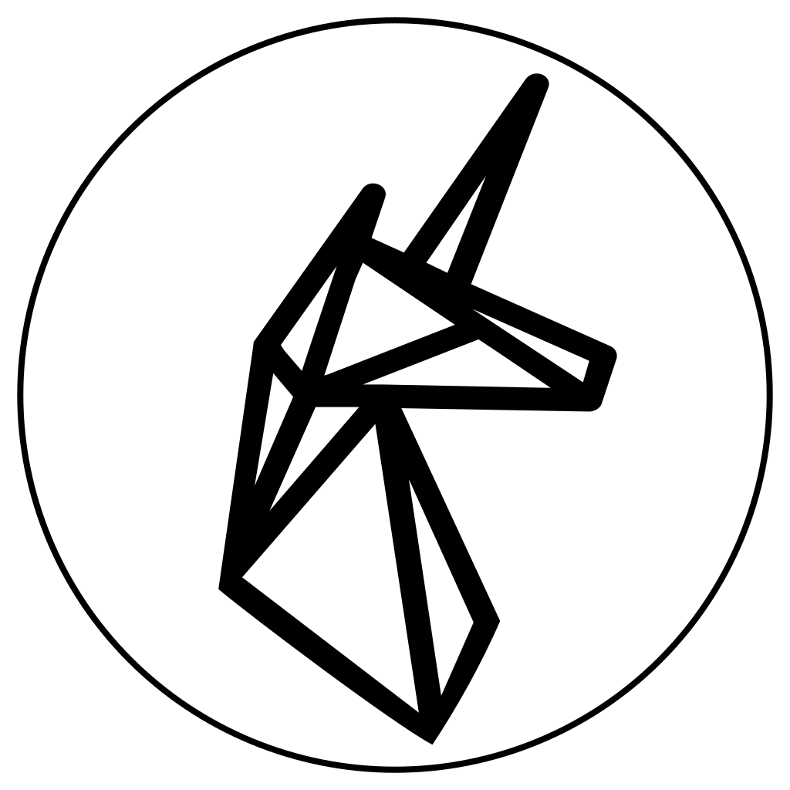

# theunicorn 

Specs and proposals for the World Computer.

## Principles

Read [The Ethereum Unicorn](./The_Ethereum_Unicorn.md)

See [specific principles here](./principles).

## Proposals

- [Next Generation dApps](proposals/Next_Gen_dApps.md)
- [dApp Assembly](proposals/dApp_Assembly.md)
- [Wallet Proposals](proposals/Wallet_Proposals.Tentative_EIPs_and_dTypes.md)

- [Oracle Proposals](proposals/Proposals_for_Oracles_(EIPs,_dTypes).md)

## Articles

See articles [here](./articles).
