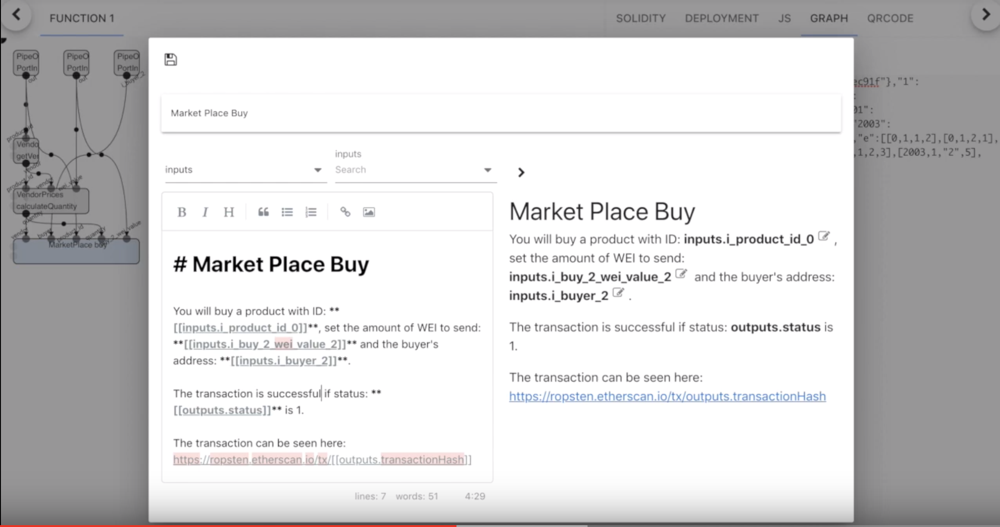

# dApp Assembly

As per our umbrella proposal for a tighter integration of the Ethereum projects ([The Unicorn](../The_Ethereum_Unicorn.md)), we will make some proposals for having an IDE for creating next generation dApps. For an easy to understand parallel, you can think of this IDE as the XCode for web3.

The next generation dApps, as first described in [Wallet Proposals. Tentative EIPs and dTypes](./Wallet_Proposals.Tentative_EIPs_and_dTypes.md), are treated as interoperable components, that can have dependencies on one another. So, in this sense, it is better than XCode.

## Characteristics of the Next Gen dApps

- target a single purpose, even though they might use multiple other dApps within that purpose
- interoperable with other dApps through a permissioned communication system
- content is stored on a decentralized storage system
- dApp can be registered in a globally available registry, at creation time
- persistence is of two types:
  - public data - stored on-chain or in a decentralized storage system
  - private data - user maintains ownership of that data, encrypted storage, saved on the user's device, in the wallet

## Components of the Next Gen dApps

- data inputs/outputs
- functions: Javascript and on-chain EVM functions
- dtypes (with UI)
- processes/metafunctions will have UI components (e.g. Pipeline graphs)
- permissions
- dependency dApps

## Resources Needed to build a dApp

- web3 provider
- smart contract component
- other dApps (e.g. login component, storage component, etc.)
- access to global scope data, common across dApps
- general framework for secure, permissioned communication with external components

## Implementation of this Vision

An incipient demo of this vision can be found at https://youtu.be/Op-BSbFJUR4. Pipeline was started as a tool to incentivize interoperability between projects: using their on-chain and off-chain components to create dApps that bridge them, in a visual way. We have reached a stage where users can create scripts (Solidity, JavaScript) through graphs and add Markdown, in order to have their own dApp.

In the above image, you can see how developers are able to insert components (inputs & outputs of a function in this case) at cursor location. Those inputs and outputs are dTypes and can have custom UIs, provided by external components. See our demo https://youtu.be/zcq2di8QIUE?t=143 for a custom UI for a Geopoint dType.

We propose this choose & mix concept as a plugin for Remix. There are already Remix plugins that could be used as drop-in components: 3Box (login, storage), One Click Dapp (ABI-based UIs) for dApp creation.

### dApp Creation

- choose external components (dApps)
- create the dApp interface (Markdown, HTML) and plug in the external dApps through templates, as shown above
- expose your dApp to be used by other dApps - define inputs & outputs with dType
- deploy your dApp on a decentralized storage system (Swarm, IPFS, etc.)
- register your dApp to receive a unique identifier

At creation, dApps can be assigned a unique identifier and the developer should be able to register the dApp, so it can be found by dApp Browsers, wallets, etc. as well as become a resource for the dApp Assembly, for building future dApps.

### Common Standards for Plugins/dApps

- common data types, provided by dType
- standardized permissions system
- adaptors for choosing public or private storage systems
- common registration pattern (unique identifier, dependency tree)

## Why Remix is the Best Option

### Techically:

- already has a permissioned plugin system
- plugins can collaborate with one another
- already has a wide range of resources for dApp creation

### Collaboration-wise:

- the team has a continous, transparent and open dialogue with plugin devs
- they already collaborate with multiple projects from the ecosystem
- at presentations, they presented the plugins as well

## Possible Interested Parties

- [Remix](https://remix.ethereum.org)
- Existent Remix plugins:
    - [One Click Dapp](https://oneclickdapp.com)
    - [3Box](https://3box.io/)
    - [Pipeline](https://github.com/pipeos-one/pipeline)
    - TBD
- [WalletConnect](https://walletconnect.org)
- [dType](https://github.com/pipeos-one/dType)

## Conclusions

Remix should ask for funding & make the strategy and the subteams that should work on this, having the above parties as possible collaborators.

Remix should also have a consumer app for mobiles and desktops, for final users. As a demo, look at PipEm: https://youtu.be/tR5X38uq1JY. This consumer can be an app, usable inside any wallet, or a wallet plugin.
